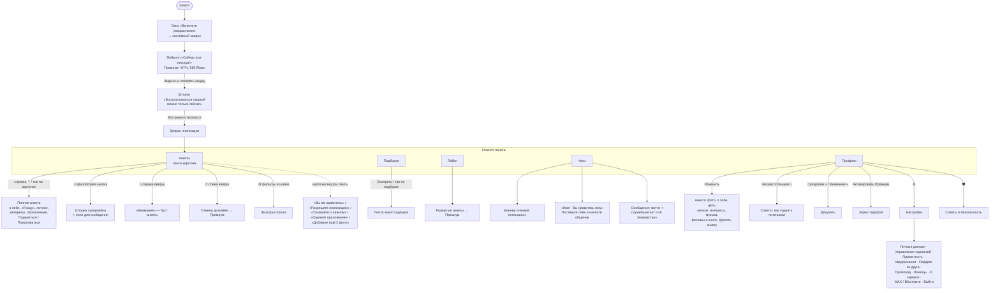

# 1. Экраны и навигация

Как устроено Android-приложение VK Знакомства (версия 1.40) — по двум записям экрана от 25.09.2026. Где что-то взято не из записи, это помечено.

Метки источников: **[Видео]** — видно на записи, **[Разраб]** — официальные ответы разработчика на отзывы в Google Play, **[Отзывы]** — отзывы пользователей, **[СМИ]** — статьи и пресс-релизы, **[Гипотеза]** — наш вывод, нужна проверка.

---

## Каркас приложения

Тёмная тема, внизу постоянная панель из пяти вкладок **[Видео]**:

| Вкладка | Иконка | Что внутри | Бейдж |
|---|---|---|---|
| **Анкеты** | две карточки | лента анкет — главный экран, открывается по умолчанию | — |
| **Подборки** | сердце с лупой | тематические подборки людей | — |
| **Лайки** | сердце | кто лайкнул (без Премиума размыто) | серый счётчик входящих лайков (на записи «28») |
| **Чаты** | облачко | мэтчи и переписки | красная точка с числом непрочитанных (на записи «1») |
| **Профиль** | человечек | своя анкета, счётчики, Премиум, настройки | — |

Красный бейдж есть только у «Чатов». Серый счётчик на «Лайках» копится всё время, и без Премиума посмотреть этих людей нельзя. Это главный «крючок» приложения — см. [02_mekhaniki.md](02_mekhaniki.md).

---

## Карта переходов

---

## Первый запуск (уже зарегистрированный пользователь) — [Видео А, 0:00–0:14]

1. **«Включите уведомления».** Сначала своё окно: «Будет показано окно с предложением включить уведомления», кнопки [Отмена] / [Хорошо]. Потом системный запрос Android: «Разрешить приложению VK Знакомства отправлять уведомления?». Если отказать, появится ещё одно окно: «Приложению требуется доступ к push-уведомлениям. Предоставить доступ можно в настройках» [ОТМЕНА] / [ОТКРЫТЬ].
2. **Пейволл сразу после входа.** «Сейчас или никогда! Больше не предложим». Плашка «−67% На Премиум», цена ~~1 815~~ **599 ₽ в месяц**, «Дешевле точно не будет». Кнопки [Оформить со скидкой] и [Закрыть и потерять скидку]. Если нажать «Закрыть», выезжает шторка «Воспользоваться скидкой можно только сейчас. Если закроете это предложение, то больше не получите такую скидку» [Оформить со скидкой] / [Всё равно отказаться].
3. **Запрос геопозиции** поверх ленты: «Разрешите доступ к геопозиции, чтобы использовать все функции сервиса «VK Знакомства»» [ОТКЛОНИТЬ] / [РАЗРЕШИТЬ].
4. Лента. **Первой стоит анкета человека, который поставил суперлайк**, с плашкой «Поставила вам суперлайк».

Итого до первой анкеты — три-четыре окна: уведомления, пейволл, подтверждение отказа, геопозиция.

**Регистрация новичка** на записи не попала. По скриншотам из стора и описанию **[СМИ]**: вход через VK ID, данные подтягиваются со страницы ВК. Дальше экран с фото, именем, датой рождения и полом и кнопка **«Начать знакомиться»**. Имя, дата рождения и пол потом меняются только один раз: «Указывайте настоящие данные. Вы больше не сможете изменить их» **[Видео Б]**.

---

## Вкладка «Анкеты» (лента) — [Видео А и Б]

**Шапка:** логотип «VK Знакомства» слева, иконка фильтров справа.

**Карточка анкеты** (на весь экран):
- сверху полоски-индикаторы фото, как в сторис; фото листаются тапом;
- **слева вверху ↺** — вернуть последнюю пропущенную анкету (это «Отмена дизлайка», входит в Премиум);
- **справа вверху ⚡** на жёлтом фоне — **«Внимание»** (буст);
- внизу чипы: статус **«Онлайн» / «Был(а) сегодня»** и расстояние **«8 км» / «Меньше 3 км»** или город («Волгоград»);
- **Имя, возраст**, синяя **галочка** (анкета подтверждена), фиолетовая **корона** (у человека Премиум, «специальный значок»);
- под именем — один из блоков, их можно листать: цитата из «о себе», **«Интересы»** (общие с вами подсвечены розовым), **«Я ищу»** (Серьёзные отношения / Дружеское общение / Новый опыт…), **«Личное»** (знак зодиака, «Свободна», рост, «Пью/Редко», «Есть дети», «Не курю», «Хожу пешком»);
- **плашка «Поставил(а) вам суперлайк»** с огоньком — если человек отправил вам суперлайк;
- **три большие кнопки:** красная **✕** (пропустить), фиолетовая **🔥** (суперлайк), синяя **♡** (лайк). Работают и свайпы: влево — пропуск (карточка окрашивается красным), вправо — лайк.

**Полная анкета** (стрелка ⌃ или тап по нижней части): фото уезжает наверх. Ниже: статус, расстояние со значком «?», кнопка «поделиться» ↗, полный текст «о себе», «Я ищу», «Личное», «Образование» / «Образование и работа», «Интересы». В самом низу — **[Поделиться]** и красная **[Пожаловаться]**. Кнопки ✕ / 🔥 / ♡ остаются внизу экрана.

**Всплывающие подсказки на ленте:**
- **«Упс! Вы упустили мэтч»** — облачко у кнопки ↺. Появляется, когда вы пропустили человека, который уже лайкнул вас. Подталкивает нажать ↺, а это Премиум.

**Карточки, которые встают в ленту вместо анкет:**
- **«Вы им нравитесь»** — «Мэтч уже рядом — откройте анкету бесплатно и ответьте на лайк», сетка из 4 размытых фото с кнопками [Открыть] **[Видео Б, 0:32]**;
- **«Знакомьтесь с теми, кто рядом»** — «Разрешите приложению доступ к местоположению и смотрите анкеты людей поблизости» [Разрешить доступ], можно закрыть ✕;
- **«Узнавайте о важном»** — «Включите и настройте push-уведомления, чтобы не пропустить интересное. Например, мэтчи или лайки» [Включить уведомления];
- **«Оцените приложение»** — 5 звёзд и [Оценить];
- **«Добавьте себе ещё 2 фото и смотрите все»** — «И смотрите все фото других людей» [Добавить фото]. Стоит на месте фото, которые вам «не положены»: вы видите у других столько фото, сколько загрузили сами **[Отзывы, январь 2026]**.

**Шторка суперлайка** — открывается по кнопке 🔥 **[Видео А, 1:14]**:
> **Наталья получает много лайков**
> Отправьте суперлайк, чтобы увеличить шансы на мэтч. Получатель увидит вашу анкету среди первых с сообщением
> [Напишите что-нибудь приятное]
> **[Отправить]**
> «5 суперлайков бесплатно каждую неделю с Премиум»

---

## Вкладка «Подборки» — [Видео А, 1:20–1:29; Б, 1:45]

Заголовок «Подборки», справа иконка фильтров. Лента из карточек-обложек, внизу подпись **«25 подборок»**.

- **Большая карточка сверху** с кнопкой [Смотреть] — например, «Ценят баланс · Изучают себя · Интересы».
- **«Рекомендуем»** — «Подборки анкет от VK Знакомств, которые могут вам понравиться»: **«Онлайн · Знакомятся сейчас»**.
- **«На одной волне с вами»** — «Смотрите анкеты людей, интересы которых совпадают с вашими»: «Ценят эстетику · Творческий взгляд», «Любят музыку · Слушают сердцем», «Любят спорт · Болельщики и спортсмены», «Ищут друзей · Друзья познаются здесь», «Создают красоту · Творческие личности».
- **«Интересы притягивают»** — «Анкеты людей, которых объединяют увлечения и цели. Выбирайте, с кем интереснее!»: «Ценят спокойствие · Любят отдых и уют», «Жаждут знаний · Стремятся к новому», «Любят ужасы · Охотники за мурашками», «Любят читать · Посоветуют хорошую книгу», «Любят бегать · Устройте пробежку вместе», «Смотрят кино · С ними все вечера уютные», «Ищут любовь · В поиске отношений», «Ценят искусство · Тонко чувствуют», «Любят природу · Отдыхают вдали от суеты», «Любят туризм · Покорите мир вместе», «Знают толк в еде · Расскажут, где вкуснее всего», «Любят видеоигры · Исследуют игровые миры», «Любят тусовки · Знают, куда сходить», «Следят за модой · Разбираются в стиле», «Любят животных · Питомцы сближают», «Отдыхают активно · С ними не соскучишься», «Ищут новый опыт · Открыты для нового», «Ценят лёгкость · Ищут свободные отношения».

Под каждой подборкой подписан тип: «Интересы» или «Цель знакомства». Подборки собраны по интересам и целям, которые люди выбирают в своей анкете.

---

## Вкладка «Лайки»

На записи её не открывали, виден только бейдж «28». Что известно:
- без Премиума анкеты тех, кто лайкнул, **размыты**, видно только число **[Отзывы, Разраб]**;
- «на заблюренные анкеты в лайках ответить нельзя» **[Отзывы, 2025]**;
- в Премиуме — «Просмотр всех лайков, которые поставили вы или вам», то есть и входящие, и исходящие **[Видео Б]**;
- на один из входящих лайков можно ответить бесплатно — через карточку **«Вы им нравитесь»** в ленте **[Видео Б]**;
- из пуша «вам поставили лайк» человек попадает на размытую анкету и пейволл **[Отзывы]**.

➡️ Нужна запись экрана вкладки «Лайки».

---

## Вкладка «Чаты» — [Видео Б, 1:00–1:02]

Сверху вниз:
1. Баннер **«Низкий потенциал · 50%»** — «Такую анкету видят нечасто — но это можно исправить», закрывается ✕.
2. Строка **«Серега · 💗 Вы нравитесь ему»** — «Поставьте лайк и начните общение прямо сейчас». Аватар пустой или размытый. **[Гипотеза]** Так в чатах показывается входящий суперлайк или раскрытый лайк: ответишь лайком — откроется чат.
3. Раздел **«Сообщения»** — переписки. На записи там только служебный чат **«VK Знакомства ✓»**: «Ещё не пробовали наше отдельное при[ложение]…» (3 недели назад). Так сервис пишет пользователю напрямую.
4. Внизу подпись «1 чат».

Экран переписки на записи не попал. Что в нём есть, см. [02_mekhaniki.md → Чат](02_mekhaniki.md#чат).

---

## Вкладка «Профиль» — [Видео Б, 0:36–1:06]

- Шапка: справа 🛡 (**«Советы и безопасность»**) и ⚙ (**Настройки**).
- Аватар, «Имя, возраст», кнопки **[Изменить]** и «поделиться» ↗.
- Плашка **«Низкий потенциал · 50%»** › — «Такую анкету видят нечасто — но это можно исправить».
- Два счётчика с плюсиком: **«Суперлайк 3»** (фиолетовый огонёк) и **«Внимание 0»** (оранжевая молния). Плюсик ведёт к покупке.
- Блок **«Подключите Премиум — Знакомьтесь без ограничений»**, кнопка [Активировать Премиум] и список из 9 преимуществ (см. [03_monetizatsiya.md](03_monetizatsiya.md)).

### «Потенциал» — экран советов (по тапу на плашку)
Круговая шкала **50%**, «Низкий потенциал. Такую анкету видят нечасто. Ниже — советы, как повысить потенциал профиля». Советы с прибавкой:

| Совет | Прибавка |
|---|---|
| Расскажите о себе — «Заполните профиль полностью» | +35% |
| Добавьте фото — «Лучше загрузить все 6» | +21% |
| Подтвердите анкету — «Так вам будут больше доверять» | +13% |
| Включите уведомления — «Чтобы не пропустить важное» | +5% |
| Нет брошенных чатов — «Так держать!» | ✓ |
| Общение идёт — «Продолжайте переписываться» | ✓ |

Кнопка [Понятно].

### «Анкета» — редактирование (по кнопке «Изменить»)
Шапка: ✕ и ✓. Сверху та же шкала потенциала. Дальше блоки, у каждого зелёная подпись, сколько процентов он даёт:
- **Подтвердите анкету** (+13%) — «Сначала нужно добавить хотя бы 3 фото или видео. После проверки потенциал вырастет на 13%» [Подтвердить];
- **Фото и видео** (+21%) — 6 ячеек, у каждой свой бонус (+2 / +7 / +5 / +3 / +2%); «Фото и видео можно менять местами. Самую удачную фотографию лучше поставить первой»;
- **О себе** (+16%) — «Рассказ о себе увеличит потенциал от 3% до 12% — зависит от длины текста. А если заполните поля «Образование» и «Карьера», добавим по 2% за каждое»; поля «Расскажите о себе», «Образование», «Работа»;
- **Цель знакомства** (5%) — «Стоит договориться на берегу». Варианты «Я ищу» на записи: Серьёзные отношения, Дружеское общение, Новый опыт; в подборках ещё встречается «Свободные отношения»;
- **Личное** (до 5%) — мастер из 6 шагов: «У вас сейчас есть кто-то? Только честно» (Свободен / В отношениях / Всё сложно / Не указывать), «Какого вы роста? Для многих это важно» (ползунок), «Вы выпиваете? А по пятницам?» (Не пью / Редко / Пью), «Вы курите? Если не секрет» (Не курю / Курю за компанию / Бросаю курить / Курю / Вейп), «Вы занимаетесь спортом? Можете приукрасить, мы не осудим» (Не люблю спорт / Хожу пешком / Держу форму / Живу спортом), шестой шаг — дети (на записи ответ «Нет и не планирую»);
- **Интересы** (до 5%) — до 10 штук («Выбрано 7 из 10») из категорий: Хобби, Социальная жизнь, Творчество, Активный образ жизни, Еда и напитки, Спорт, Время дома, Путешествия, Домашние животные, Фильмы и сериалы, Музыка;
- **Музыка** (+2%) — «Добавьте любимых исполнителей, чтобы найти тех, с кем вы на одной волне», до 7 исполнителей, есть поиск и список «Популярное» (MACAN, Big Baby Tape, Баста, Макс Корж, Mona, Artik & Asti…);
- **Фильмы и книги** — по 1% за каждый ответ;
- в самом низу — красная **«Удалить анкету»**.

### Настройки (⚙)
- Аккаунт VK ID — «Управление VK ID».
- **Местоположение**: «Волгоград — Город выбран вручную. Разрешите доступ к местоположению, чтобы видеть более точное расстояние до людей» [Разрешить] / [Изменить]. Значит, **город можно выбрать вручную**, хотя в отзывах часто пишут, что нельзя.
- **Личные данные** — имя, дата рождения, пол. Меняются один раз, нужно подтвердить галочкой «Я понимаю, что больше не смогу изменить личные данные».
- **Управление подпиской**.
- **Приватность** → «Советы и безопасность» и три переключателя:
  - **«Знакомлюсь»** — «Если вы знакомитесь, то видите анкеты других людей и они видят вашу». Это и есть пауза: выключили — пропали из ленты;
  - «Разрешаю делиться своей анкетой»;
  - «Разрешаю обмениваться со мной изображениями в чате».
- **Уведомления** — если пуши выключены: «Сразу узнавайте о самом интересном — например, о лайках или мэтчах» [Включить уведомления]. Раздел «Дополнительно» → **«Звуки в приложении — Момент мэтча зазвучит по-особенному»**.
- **Получить подарок за друга** (реферальная программа), **Ввести промокод**.
- Помощь, О сервисе.
- «Мы в социальных сетях»: **MAX**, **ВКонтакте**.
- Выйти из аккаунта.

---

## Типичный путь пользователя

Собрано из записей и отзывов.

1. **Заход по пушу** («вам поставили лайк» / «у вас мэтч» / «новое сообщение») или по привычке. Открывается лента.
2. **Листание ленты** — основное время. Смотрят первое фото, иногда открывают полную анкету стрелкой ⌃, свайпают. Анкеты тех, кто поставил суперлайк, идут первыми.
3. **Проверяют «Лайки»** — виден только счётчик, анкеты размыты. Отсюда главный поток «надо платить, чтобы увидеть, кто лайкнул».
4. **«Чаты»** — отвечают на мэтчи; служебный чат VK Знакомств.
5. **«Профиль»** — реже: поправить анкету, посмотреть потенциал, купить Премиум, настройки.
6. **«Подборки»** — редкая вкладка. В отзывах упоминается в 17 раз реже, чем «лайки» и «мэтчи». Кто пользуется, хвалят: «Весьма крутая фишка с подборками. Легко найти кого-то по интересам». Жалуются на пропавшие подборки: «убрали подборку онлайн» в мини-приложении ВК, «жаль убрали подборку по геймерам».
7. **Анкеты заканчиваются** — «анкеты закончились», в ленте повторы. Приложение предлагает Премиум или «подождать». Разработчик советует расширить радиус и возраст в фильтрах.

---

## Мини-приложение в ВК и отдельное приложение

- **Мини-приложение**: vk.ru/dating, раздел «Сервисы» ВКонтакте. Сервис появился там в ноябре 2021 **[СМИ]**. Отдельные приложения для iOS и Android — с 2023 года.
- Анкета и переписки общие: «ответить взаимностью можно из любого нашего приложения» **[Разраб]**.
- Часть функций есть только в отдельном приложении, например «подборка онлайн». Пользователи мини-приложения считают, что их так подталкивают скачать приложение **[Отзывы]**.
- **Пакеты суперлайков за голоса VK** покупаются в мобильной веб-версии m.vk.com/dating **[Разраб]**.
- **iOS**: в июне 2026 Apple удалила приложения VK из App Store, VK Знакомства тоже. Установленные продолжают работать, новые пользователи iPhone идут через мини-приложение **[СМИ]**.
