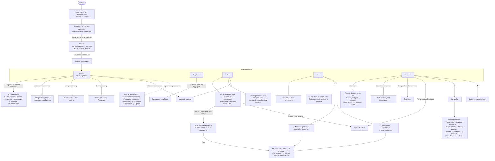

# VK Знакомства: как устроен пользовательский опыт (полная версия в одном файле)

Исследование для SMM: как устроено приложение, как им пользуются обычные люди, что их радует и злит. Только VK Знакомства, без сравнения с конкурентами. Актуально на **25.09.2026**, Android-версия 1.40.

## Главное за минуту

- **Пять вкладок:** Анкеты (лента) · Подборки · Лайки · Чаты · Профиль. Почти всё время человек проводит в ленте.
- **Три кнопки на карточке:** ✕ пропустить · 🔥 суперлайк · ♡ лайк. Над фото: ↺ вернуть анкету (Премиум) и ⚡ «Внимание» (буст на 40 минут).
- **Суперлайк = лайк с запиской** (до 140 символов). У получателя вы **наверху вкладки «Лайки»** в разделе «Суперлайки» — с фото и именем, **без Премиума** — и **первым в ленте** с плашкой «Поставил(а) вам суперлайк». Обычный лайк приходит размытой карточкой. Ответ на суперлайк даёт мэтч с экраном «**Суперлайк свёл вас**». В Премиуме — 5 суперлайков в неделю (не в день).
- **Мэтч = взаимный лайк:** экран мэтча с эмодзи-ответами, человек появляется в «Чатах» → «Мэтчи». В чате есть голосовые, фото (после пары сообщений или подтверждения анкеты), «вопрос от VK Знакомств» для начала разговора, «Удалить симпатию» и жалоба.
- **Вкладка «Лайки»** — две части: «Я нравлюсь» (суперлайки открыто, обычные лайки размыто, но на них можно ответить ♡ вслепую) и «Мне нравятся» (кого лайкнули вы, с кнопкой «Суперлайк»).
- **Бесплатные фильтры:** Девушки / Парни / Все, возраст, радиус («если анкет мало, радиус чуть-чуть увеличится»).
- **Главная боль** — «не видно, кто лайкнул, без Премиума». Её подогревают пуши «вам поставили лайк». Следом — фейки, мошенники и автопродление подписки.
- **Главные плюсы** в глазах людей: друзья ВК не увидят анкету, вход в одно касание через ВК, удобный и красивый интерфейс.
- **Пользователи не знают** про подборки, потенциал анкеты, паузу («Знакомлюсь»), ручной выбор города и запрет картинок в чате. Это готовые темы для постов.
- Рейтинг Google Play 4,3, но в 2026 году средняя оценка отзывов с текстом упала до 2,1.

## Источники и метод

- **Три записи экрана** Android-приложения от 25.09.2026 (А — 1,5 мин, Б — 2 мин, В — 1,3 мин) и скрины фильтров. Разобраны по кадрам: лента, суперлайк (отправка и получение), подборки, лайки, мэтч, чат, профиль, потенциал, редактирование анкеты, настройки, Премиум, фильтры. Метка **[Видео]**.
- **Все отзывы из Google Play на русском**: 12 225 шт. за июнь 2023 — сентябрь 2026, выгружены целиком. Метка **[Отзывы]**.
- **Ответы разработчика** на ~11 тыс. отзывов — официальные объяснения механик. Метка **[Разраб]**.
- **Страницы RuStore и Google Play**: рейтинг, версия, описание, ответы в RuStore.
- **СМИ и официальные материалы** (метка **[СМИ]**):
  - [Т—Ж, январь 2026](https://t-j.ru/vk-dating/)
  - [RuStore Prostore, апрель 2026](https://www.rustore.ru/prostore/vk-znakomstva)
  - [datenow, март 2026](https://datenow.ru/obzory/vk-znakomstva/)
  - [ADPASS, 2023](https://adpass.ru/seans-romanticheskogo-vnimaniya-ot-79-rublej-proshhaemsya-s-tinder-i-testiruem-vk-znakomstva/)
  - [пресс-релиз VK о запуске, ноябрь 2021](https://vk.company/ru/press/releases/11051/)
  - [CNews: голосовые и изображения, май 2026](https://www.cnews.ru/news/line/2026-05-14_vk_znakomstva_rasshirili)
  - [CNews: удаление из App Store, июнь 2026](https://www.cnews.ru/news/top/2026-06-25_vk_vygnali_iz_app_storedzen)
  - [Хабр: ночной чат](https://habr.com/ru/news/699046/)
  - [лендинг dating.vk.ru](https://dating.vk.ru/)
  - [сообщество vk.ru/vkdating](https://vk.ru/vkdating)
- Метка **[Гипотеза]** — наш вывод, который нужно проверить.

**Приоритет при расхождениях:** запись экрана → ответы разработчика → свежие отзывы → статьи. В статьях много устаревшего: суперлайки «в день», старые цены, ночной чат.

**Не удалось проверить:** отзывы App Store (приложение удалено из стора), irecommend и 4PDA (закрыты для автоматического доступа), справка VK (требует входа), видеообзоры на YouTube (скачивание заблокировано).

---

# 1. Экраны и навигация

Как устроено Android-приложение VK Знакомства (версия 1.40) — по трём записям экрана (А, Б, В) и скринам фильтров от 25.09.2026. Где что-то взято не из записи, это помечено.

Метки источников: **[Видео]** — видно на записи, **[Разраб]** — официальные ответы разработчика на отзывы в Google Play, **[Отзывы]** — отзывы пользователей, **[СМИ]** — статьи и пресс-релизы, **[Гипотеза]** — наш вывод, нужна проверка.

---

## Каркас приложения

Тёмная тема, внизу постоянная панель из пяти вкладок **[Видео]**:

| Вкладка | Иконка | Что внутри | Бейдж |
|---|---|---|---|
| **Анкеты** | две карточки | лента анкет — главный экран, открывается по умолчанию | — |
| **Подборки** | сердце с лупой | тематические подборки людей | — |
| **Лайки** | сердце | «Я нравлюсь» (суперлайки + размытые лайки) / «Мне нравятся» (кого лайкнули вы) | серый счётчик входящих лайков (на записи «28») |
| **Чаты** | облачко | мэтчи и переписки | красная точка с числом непрочитанных (на записи «1») |
| **Профиль** | человечек | своя анкета, счётчики, Премиум, настройки | — |

Красный бейдж есть только у «Чатов». Серый счётчик на «Лайках» копится всё время, и без Премиума посмотреть этих людей нельзя. Это главный «крючок» приложения — см. раздел «2. Механики».

---

## Карта переходов

---

## Первый запуск (уже зарегистрированный пользователь) — [Видео А, 0:00–0:14]

1. **«Включите уведомления».** Сначала своё окно: «Будет показано окно с предложением включить уведомления», кнопки [Отмена] / [Хорошо]. Потом системный запрос Android: «Разрешить приложению VK Знакомства отправлять уведомления?». Если отказать, появится ещё одно окно: «Приложению требуется доступ к push-уведомлениям. Предоставить доступ можно в настройках» [ОТМЕНА] / [ОТКРЫТЬ].
2. **Пейволл сразу после входа.** «Сейчас или никогда! Больше не предложим». Плашка «−67% На Премиум», цена ~~1 815~~ **599 ₽ в месяц**, «Дешевле точно не будет». Кнопки [Оформить со скидкой] и [Закрыть и потерять скидку]. Если нажать «Закрыть», выезжает шторка «Воспользоваться скидкой можно только сейчас. Если закроете это предложение, то больше не получите такую скидку» [Оформить со скидкой] / [Всё равно отказаться].
3. **Запрос геопозиции** поверх ленты: «Разрешите доступ к геопозиции, чтобы использовать все функции сервиса «VK Знакомства»» [ОТКЛОНИТЬ] / [РАЗРЕШИТЬ].
4. Лента. **Первой стоит анкета человека, который поставил суперлайк**, с плашкой «Поставила вам суперлайк».

Итого до первой анкеты — три-четыре окна: уведомления, пейволл, подтверждение отказа, геопозиция.

**Регистрация новичка** на записи не попала. По скриншотам из стора и описанию **[СМИ]**: вход через VK ID, данные подтягиваются со страницы ВК. Дальше экран с фото, именем, датой рождения и полом и кнопка **«Начать знакомиться»**. Имя, дата рождения и пол потом меняются только один раз: «Указывайте настоящие данные. Вы больше не сможете изменить их» **[Видео Б]**.

---

## Вкладка «Анкеты» (лента) — [Видео А и Б]

**Шапка:** логотип «VK Знакомства» слева, иконка фильтров справа.

**Карточка анкеты** (на весь экран):
- сверху полоски-индикаторы фото, как в сторис; фото листаются тапом;
- **слева вверху ↺** — вернуть последнюю пропущенную анкету (это «Отмена дизлайка», входит в Премиум);
- **справа вверху ⚡** на жёлтом фоне — **«Внимание»** (буст);
- внизу чипы: статус **«Онлайн» / «Был(а) сегодня»** и расстояние **«8 км» / «Меньше 3 км»** или город («Волгоград»);
- **Имя, возраст**, синяя **галочка** (анкета подтверждена), фиолетовая **корона** (у человека Премиум, «специальный значок»);
- под именем — один из блоков, их можно листать: цитата из «о себе», **«Интересы»** (общие с вами подсвечены розовым), **«Я ищу»** (Серьёзные отношения / Дружеское общение / Новый опыт…), **«Личное»** (знак зодиака, «Свободна», рост, «Пью/Редко», «Есть дети», «Не курю», «Хожу пешком»);
- **плашка «Поставил(а) вам суперлайк»** с огоньком — если человек отправил вам суперлайк;
- **три большие кнопки:** красная **✕** (пропустить), фиолетовая **🔥** (суперлайк), синяя **♡** (лайк). Работают и свайпы: влево — пропуск (карточка окрашивается красным), вправо — лайк.

**Полная анкета** (стрелка ⌃ или тап по нижней части): фото уезжает наверх. Ниже: статус, расстояние со значком «?», кнопка «поделиться» ↗, полный текст «о себе», «Я ищу», «Личное», «Образование» / «Образование и работа», «Интересы». В самом низу — **[Поделиться]** и красная **[Пожаловаться]**. Кнопки ✕ / 🔥 / ♡ остаются внизу экрана.

**Всплывающие подсказки на ленте:**
- **«Упс! Вы упустили мэтч»** — облачко у кнопки ↺. Появляется, когда вы пропустили человека, который уже лайкнул вас. Подталкивает нажать ↺, а это Премиум.

**Карточки, которые встают в ленту вместо анкет:**
- **«Вы им нравитесь»** — «Мэтч уже рядом — откройте анкету бесплатно и ответьте на лайк», сетка из 4 размытых фото с кнопками [Открыть] **[Видео Б, 0:32]**;
- **«Знакомьтесь с теми, кто рядом»** — «Разрешите приложению доступ к местоположению и смотрите анкеты людей поблизости» [Разрешить доступ], можно закрыть ✕;
- **«Узнавайте о важном»** — «Включите и настройте push-уведомления, чтобы не пропустить интересное. Например, мэтчи или лайки» [Включить уведомления];
- **«Оцените приложение»** — 5 звёзд и [Оценить];
- **«Добавьте себе ещё 2 фото и смотрите все»** — «И смотрите все фото других людей» [Добавить фото]. Стоит на месте фото, которые вам «не положены»: вы видите у других столько фото, сколько загрузили сами **[Отзывы, январь 2026]**.

**Шторка суперлайка** — открывается по кнопке 🔥 **[Видео А, 1:14]**:
> **Наталья получает много лайков**
> Отправьте суперлайк, чтобы увеличить шансы на мэтч. Получатель увидит вашу анкету среди первых с сообщением
> [Напишите что-нибудь приятное]
> **[Отправить]**
> «5 суперлайков бесплатно каждую неделю с Премиум»

---

## Вкладка «Подборки» — [Видео А, 1:20–1:29; Б, 1:45]

Заголовок «Подборки», справа иконка фильтров. Лента из карточек-обложек, внизу подпись **«25 подборок»**.

- **Большая карточка сверху** с кнопкой [Смотреть] — например, «Ценят баланс · Изучают себя · Интересы».
- **«Рекомендуем»** — «Подборки анкет от VK Знакомств, которые могут вам понравиться»: **«Онлайн · Знакомятся сейчас»**.
- **«На одной волне с вами»** — «Смотрите анкеты людей, интересы которых совпадают с вашими»: «Ценят эстетику · Творческий взгляд», «Любят музыку · Слушают сердцем», «Любят спорт · Болельщики и спортсмены», «Ищут друзей · Друзья познаются здесь», «Создают красоту · Творческие личности».
- **«Интересы притягивают»** — «Анкеты людей, которых объединяют увлечения и цели. Выбирайте, с кем интереснее!»: «Ценят спокойствие · Любят отдых и уют», «Жаждут знаний · Стремятся к новому», «Любят ужасы · Охотники за мурашками», «Любят читать · Посоветуют хорошую книгу», «Любят бегать · Устройте пробежку вместе», «Смотрят кино · С ними все вечера уютные», «Ищут любовь · В поиске отношений», «Ценят искусство · Тонко чувствуют», «Любят природу · Отдыхают вдали от суеты», «Любят туризм · Покорите мир вместе», «Знают толк в еде · Расскажут, где вкуснее всего», «Любят видеоигры · Исследуют игровые миры», «Любят тусовки · Знают, куда сходить», «Следят за модой · Разбираются в стиле», «Любят животных · Питомцы сближают», «Отдыхают активно · С ними не соскучишься», «Ищут новый опыт · Открыты для нового», «Ценят лёгкость · Ищут свободные отношения».

Под каждой подборкой подписан тип: «Интересы» или «Цель знакомства». Подборки собраны по интересам и целям, которые люди выбирают в своей анкете.

---

## Вкладка «Лайки» — [Видео В, 0:03–0:32; скрины фильтров]

**Шапка:** «Лайки» и иконка фильтров справа. Под шапкой переключатель из двух вкладок: **«Я нравлюсь»** и **«Мне нравятся»**.

### «Я нравлюсь» — кто лайкнул вас
Сверху вниз:
1. **Раздел «Суперлайки»** — карточки с **открытым фото и именем**: «**Кристина отправила вам суперлайк** — Это знак особой симпатии. Ответите взаимностью?», на аватаре фиолетовый огонёк. Тап открывает полную анкету отправителя с плашкой «Поставила вам суперлайк» и кнопками ✕ / 🔥 / ♡.
2. Баннер с короной: **«Активируйте Премиум или ищите этих людей в разделе «Анкеты»»**.
3. Кнопка-градиент **«Открыть все анкеты»** — ведёт на экран тарифов «Активируйте Премиум — И тот самый мэтч найдётся ещё быстрее».
4. **Сетка размытых анкет** обычных лайков, по две в ряд. **Под каждой — кнопки ✕ и ♡**: ответить можно вслепую, не видя человека. Если лайкнуть в ответ, будет мэтч.
5. Поверх сетки плавающая оранжевая кнопка **«⚡ Активировать внимание»**.

Серый бейдж на вкладке — число входящих лайков. После мэтча он уменьшился с 28 до 27.

### «Мне нравятся» — кого лайкнули вы
- Баннер **«Пересматривать анкеты, которые вы лайкнули, можно с Премиум»** и кнопка «Открыть все анкеты».
- Сетка анкет, **которые вы лайкнули: не размыты**, с чипом «Онлайн». **Под каждой — кнопка «🔥 Суперлайк»**. Отсюда можно «догнать» суперлайком того, кого вы уже лайкнули и кто пока не ответил.
- Бесплатно видно только несколько последних (на записи 5). Дальше — кнопка «Открыть все анкеты», то есть Премиум.

### Фильтры (иконка в шапке) — [скрины]
Шторка **«Фильтры»**:
- **Кого показывать:** «Девушки» / «Парни» / «Все»;
- **Возраст** — ползунок-диапазон (на скринах 28–38 и 18–62);
- **Радиус поиска** со значком «?» — ползунок (40 км, 115 км), подпись **«Если анкет будет мало, радиус чуть-чуть увеличится»**;
- кнопка **[Применить]**.

Бесплатно доступны только эти три фильтра. «Расширенные фильтры» — в Премиуме. Та же иконка фильтров есть в шапке «Анкет» и «Подборок». Скорее всего, настройки общие для всего приложения **[Гипотеза]**.

## Вкладка «Чаты» — [Видео Б, 1:00; Видео В, 0:35–1:16]

Сверху вниз:
1. Баннер **«Низкий потенциал · 50%»** — «Такую анкету видят нечасто — но это можно исправить», закрывается ✕.
2. **«Мэтчи»** — горизонтальная лента карточек: фото человека, кнопка **[Написать]**, синяя точка «новый». Если мэтч случился через суперлайк, на карточке фиолетовый огонёк. Мэтчи, в которых ещё никто не написал, живут здесь, а не в списке сообщений.
3. Строка **«Серега · 💗 Вы нравитесь ему»** — «Поставьте лайк и начните общение прямо сейчас». Аватар размыт. **[Гипотеза]** Это бесплатное «открытие» одного входящего лайка, как карточка «Вы им нравитесь» в ленте.
4. **«Сообщения»** — переписки. Там же служебный чат **«VK Знакомства ✓ — Чат с сервисом»**. В нём анонсы с кнопками, например:
   - «Всего есть семь статусов — посмотрите, какой больше вам подходит…» [Установить статус];
   - «Выбирайте до 10 интересов. Теперь в анкете можно указать до 10 интересов…» [Указать интересы] (июнь 2025);
   - «Ещё не пробовали наше отдельное приложение…».
5. Счётчик внизу: «1 чат». После мэтча у вкладки появляется красный бейдж «1».

### Экран чата — [Видео В, 0:43–1:16]
- **Шапка:** ←, аватар, имя с галочкой, «Была сегодня». Справа **«!»**. Тап по имени или аватару открывает полную анкету собеседника с кнопкой [Назад в чат].
- **Пустой чат после мэтча через суперлайк:** два аватара с огоньком, «**Суперлайк свёл вас** — Может, это судьба? Начните общение, чтобы узнать».
- **Строка ввода:** 📎 (вложения), «Напишите сообщение», 💬 (вопрос от сервиса), 🎤 (голосовое). Подсказка: «**Теперь можно записывать голосовые. Зажмите, чтобы начать**». Первое нажатие вызывает системный запрос Android «Разрешить приложению VK Знакомства записывать аудио?».
- **📎 — фото.** Если анкета не подтверждена, появляется шторка «**Сначала подтвердите свою анкету** — Или обменяйтесь парой сообщений — а потом можно будет и фото отправлять» [Подтвердить анкету] / [В другой раз]. «Подтвердить анкету» открывает экран «Загрузка медиа — Минимум 3 фото или видео. На них должно быть хорошо видно лицо» [Подтвердить].
- **💬 — вопрос-ледокол.** Шторка «**Задать вопрос от VK Знакомств?** — Случайный вопрос появится в чате, после чего вы сможете вместе на него ответить» [Задать вопрос]. В чате появляется розовое сообщение «Ответьте вместе на вопрос от VK Знакомств: **Каким должен быть идеальный день в вашем представлении?**».
- **«!» — жалоба.** Шторка «Хотите пожаловаться на пользователя? Укажите причину, если что-то произошло. Если просто не хотите общаться — удалите симпатию»: [Пожаловаться и заблокировать] / красная [Удалить симпатию]. Значит, **мэтч можно «разорвать» без жалобы** — отсюда «чат пропал» у второй стороны.

## Вкладка «Профиль» — [Видео Б, 0:36–1:06]

- Шапка: справа 🛡 (**«Советы и безопасность»**) и ⚙ (**Настройки**).
- Аватар, «Имя, возраст», кнопки **[Изменить]** и «поделиться» ↗.
- Плашка **«Низкий потенциал · 50%»** › — «Такую анкету видят нечасто — но это можно исправить».
- Два счётчика с плюсиком: **«Суперлайк 3»** (фиолетовый огонёк) и **«Внимание 0»** (оранжевая молния). Плюсик ведёт к покупке.
- Блок **«Подключите Премиум — Знакомьтесь без ограничений»**, кнопка [Активировать Премиум] и список из 9 преимуществ (см. раздел «3. Деньги»).

### «Потенциал» — экран советов (по тапу на плашку)
Круговая шкала **50%**, «Низкий потенциал. Такую анкету видят нечасто. Ниже — советы, как повысить потенциал профиля». Советы с прибавкой:

| Совет | Прибавка |
|---|---|
| Расскажите о себе — «Заполните профиль полностью» | +35% |
| Добавьте фото — «Лучше загрузить все 6» | +21% |
| Подтвердите анкету — «Так вам будут больше доверять» | +13% |
| Включите уведомления — «Чтобы не пропустить важное» | +5% |
| Нет брошенных чатов — «Так держать!» | ✓ |
| Общение идёт — «Продолжайте переписываться» | ✓ |

Кнопка [Понятно].

### «Анкета» — редактирование (по кнопке «Изменить»)
Шапка: ✕ и ✓. Сверху та же шкала потенциала. Дальше блоки, у каждого зелёная подпись, сколько процентов он даёт:
- **Подтвердите анкету** (+13%) — «Сначала нужно добавить хотя бы 3 фото или видео. После проверки потенциал вырастет на 13%» [Подтвердить];
- **Фото и видео** (+21%) — 6 ячеек, у каждой свой бонус (+2 / +7 / +5 / +3 / +2%); «Фото и видео можно менять местами. Самую удачную фотографию лучше поставить первой»;
- **О себе** (+16%) — «Рассказ о себе увеличит потенциал от 3% до 12% — зависит от длины текста. А если заполните поля «Образование» и «Карьера», добавим по 2% за каждое»; поля «Расскажите о себе», «Образование», «Работа»;
- **Цель знакомства** (5%) — «Стоит договориться на берегу». Варианты «Я ищу» на записи: Серьёзные отношения, Дружеское общение, Новый опыт; в подборках ещё встречается «Свободные отношения»;
- **Личное** (до 5%) — мастер из 6 шагов: «У вас сейчас есть кто-то? Только честно» (Свободен / В отношениях / Всё сложно / Не указывать), «Какого вы роста? Для многих это важно» (ползунок), «Вы выпиваете? А по пятницам?» (Не пью / Редко / Пью), «Вы курите? Если не секрет» (Не курю / Курю за компанию / Бросаю курить / Курю / Вейп), «Вы занимаетесь спортом? Можете приукрасить, мы не осудим» (Не люблю спорт / Хожу пешком / Держу форму / Живу спортом), шестой шаг — дети (на записи ответ «Нет и не планирую»);
- **Интересы** (до 5%) — до 10 штук («Выбрано 7 из 10») из категорий: Хобби, Социальная жизнь, Творчество, Активный образ жизни, Еда и напитки, Спорт, Время дома, Путешествия, Домашние животные, Фильмы и сериалы, Музыка;
- **Музыка** (+2%) — «Добавьте любимых исполнителей, чтобы найти тех, с кем вы на одной волне», до 7 исполнителей, есть поиск и список «Популярное» (MACAN, Big Baby Tape, Баста, Макс Корж, Mona, Artik & Asti…);
- **Фильмы и книги** — по 1% за каждый ответ;
- в самом низу — красная **«Удалить анкету»**.

### Настройки (⚙)
- Аккаунт VK ID — «Управление VK ID».
- **Местоположение**: «Волгоград — Город выбран вручную. Разрешите доступ к местоположению, чтобы видеть более точное расстояние до людей» [Разрешить] / [Изменить]. Значит, **город можно выбрать вручную**, хотя в отзывах часто пишут, что нельзя.
- **Личные данные** — имя, дата рождения, пол. Меняются один раз, нужно подтвердить галочкой «Я понимаю, что больше не смогу изменить личные данные».
- **Управление подпиской**.
- **Приватность** → «Советы и безопасность» и три переключателя:
  - **«Знакомлюсь»** — «Если вы знакомитесь, то видите анкеты других людей и они видят вашу». Это и есть пауза: выключили — пропали из ленты;
  - «Разрешаю делиться своей анкетой»;
  - «Разрешаю обмениваться со мной изображениями в чате».
- **Уведомления** — если пуши выключены: «Сразу узнавайте о самом интересном — например, о лайках или мэтчах» [Включить уведомления]. Раздел «Дополнительно» → **«Звуки в приложении — Момент мэтча зазвучит по-особенному»**.
- **Получить подарок за друга** (реферальная программа), **Ввести промокод**.
- Помощь, О сервисе.
- «Мы в социальных сетях»: **MAX**, **ВКонтакте**.
- Выйти из аккаунта.

---

## Типичный путь пользователя

Собрано из записей и отзывов.

1. **Заход по пушу** («вам поставили лайк» / «у вас мэтч» / «новое сообщение») или по привычке. Открывается лента.
2. **Листание ленты** — основное время. Смотрят первое фото, иногда открывают полную анкету стрелкой ⌃, свайпают. Анкеты тех, кто поставил суперлайк, идут первыми.
3. **Проверяют «Лайки»** — наверху суперлайки с именами, ниже размытые анкеты с ✕ / ♡ и кнопка «Открыть все анкеты». Отсюда главный поток «надо платить, чтобы увидеть, кто лайкнул». Бесплатный путь — ответить ♡ вслепую или ловить этих людей в ленте.
4. **«Чаты»** — отвечают на мэтчи; служебный чат VK Знакомств.
5. **«Профиль»** — реже: поправить анкету, посмотреть потенциал, купить Премиум, настройки.
6. **«Подборки»** — редкая вкладка. В отзывах упоминается в 17 раз реже, чем «лайки» и «мэтчи». Кто пользуется, хвалят: «Весьма крутая фишка с подборками. Легко найти кого-то по интересам». Жалуются на пропавшие подборки: «убрали подборку онлайн» в мини-приложении ВК, «жаль убрали подборку по геймерам».
7. **Анкеты заканчиваются** — «анкеты закончились», в ленте повторы. Приложение предлагает Премиум или «подождать». Разработчик советует расширить радиус и возраст в фильтрах.

---

## Мини-приложение в ВК и отдельное приложение

- **Мини-приложение**: vk.ru/dating, раздел «Сервисы» ВКонтакте. Сервис появился там в ноябре 2021 **[СМИ]**. Отдельные приложения для iOS и Android — с 2023 года.
- Анкета и переписки общие: «ответить взаимностью можно из любого нашего приложения» **[Разраб]**.
- Часть функций есть только в отдельном приложении, например «подборка онлайн». Пользователи мини-приложения считают, что их так подталкивают скачать приложение **[Отзывы]**.
- **Пакеты суперлайков за голоса VK** покупаются в мобильной веб-версии m.vk.com/dating **[Разраб]**.
- **iOS**: в июне 2026 Apple удалила приложения VK из App Store, VK Знакомства тоже. Установленные продолжают работать, новые пользователи iPhone идут через мини-приложение **[СМИ]**.

---

# 2. Механики: как всё работает

Логика приложения, собранная из трёх источников: записи экрана (сентябрь 2026), официальные ответы разработчика на отзывы в Google Play (2023–2026) и статьи. Метки: **[Видео] [Разраб] [Отзывы] [СМИ] [Гипотеза]**.

> ⚠️ В статьях много устаревшего. Например, Т—Ж (январь 2026) и RuStore (апрель 2026) пишут «5 суперлайков в день», хотя **с 6 февраля 2025 их 5 в неделю** **[Разраб]**. Цены в статьях тоже старые. Если источники спорят, верим записи экрана и ответам разработчика.

---

## Лайк

- **Как поставить:** синяя кнопка ♡ или свайп вправо в ленте **[Видео]**. Ещё можно ответить ♡ на размытую карточку во вкладке «Лайки» → «Я нравлюсь» **[Видео В]**.
- **Сколько:** без Премиума лайки ограничены. Т—Ж пишет про 100 в сутки, в отзывах — «доступные лайки каждые 12 часов». В апреле 2026 пользователи заметили, что лимит ужесточили: «с сегодняшнего дня… даже простые лайки ограничили в количестве» **[Отзывы, 16.04.2026]**. В Премиуме — «Лайки без ограничений — ставьте сколько хочется» **[Видео]**.
- **Что видит получатель:** растёт серый счётчик на вкладке «Лайки», может прийти пуш. В «Лайки» → «Я нравлюсь» появляется **размытая карточка с кнопками ✕ и ♡**. Кто это, без Премиума не видно, но ответить можно вслепую: ♡ — и сразу мэтч **[Видео В]**.
- **Как бесплатно узнать, кто лайкнул:**
  1. лайкнуть в ответ в ленте «Анкеты» — баннер в «Лайках» так и говорит: «Активируйте Премиум или **ищите этих людей в разделе «Анкеты»**» **[Видео В]**;
  2. нажать ♡ на размытой карточке в «Лайках» — будет мэтч, и человек откроется **[Видео В; Гипотеза о раскрытии]**;
  3. карточка **«Вы им нравитесь — откройте анкету бесплатно и ответьте на лайк»** в ленте и строка «Вы нравитесь ему» в «Чатах» **[Видео]**;
  4. суперлайки видны сразу, с именем и фото.
- **Лайк отменить нельзя** **[СМИ, Отзывы]**. Но мэтч можно разорвать: «!» в чате → «Удалить симпатию» **[Видео В]**.
- **Свои лайки** — вкладка «Лайки» → «**Мне нравятся**». Там бесплатно видно несколько последних (не размыты) с кнопкой «Суперлайк». Все — «Пересматривать анкеты, которые вы лайкнули, можно с Премиум» **[Видео В]**.

## Суперлайк

- **Как поставить:**
  - фиолетовая кнопка 🔥 по центру карточки в ленте или в полной анкете;
  - кнопка **«🔥 Суперлайк»** под анкетами во вкладке «Лайки» → «Мне нравятся», то есть тем, кого вы уже лайкнули **[Видео А, В]**.
- **Что происходит:** открывается шторка с аватаром. Текст отличается в зависимости от того, откуда отправляете:
  - из ленты: «**[Имя] получает много лайков.** Отправьте суперлайк, чтобы увеличить шансы на мэтч. Получатель увидит вашу анкету среди первых с сообщением» **[Видео А]**;
  - в ответ на суперлайк: «**Отправьте суперлайк.** Вас увидят сверху в разделе «Лайки» — **шанс на мэтч увеличится в 2 раза**» **[Видео В]**.

  Поле «Напишите что-нибудь приятное» (**до 140 символов**), кнопка [Отправить], ниже — «5 суперлайков бесплатно каждую неделю с Премиум». **Суперлайк — это лайк с запиской.**
- **Куда приходит суперлайк (сторона получателя)** **[Видео А, В]**:
  1. **Вкладка «Лайки» → «Я нравлюсь» → раздел «Суперлайки» — в самом верху.** Карточка с **открытым фото и именем**: «Кристина отправила вам суперлайк — Это знак особой симпатии. Ответите взаимностью?».
  2. **Первой анкетой в ленте «Анкеты»** с фиолетовой плашкой **«Поставил(а) вам суперлайк»** 🔥. Разработчик: «Входящий суперлайк сразу отображается первым в разделе анкеты» **[Разраб, 11.2025]**.
  3. В анкете отправителя — та же плашка и текст под ней. Записку видно в анкете: «вы увидите комментарий в анкете пользователя» **[Разраб]**.
  4. **Автора видно сразу, без Премиума.** Главное отличие от обычного лайка.
  5. Ответить можно «из любого нашего приложения» **[Разраб]**. По отзывам — только из отдельного приложения, в обычном ВК нельзя **[Отзывы, 11.2025]**.
- **Как ответить:** тап по карточке в «Суперлайках» → полная анкета → ♡ (лайк) или 🔥 (суперлайк в ответ). Сразу мэтч и экран «**Суперлайк свёл вас**» (см. «Мэтч») **[Видео В]**.
- **Суперлайк сам не открывает чат** — нужен ответный лайк получателя **[СМИ; Видео В]**. Боль отправителей: «если уже отправил суперлайк, то больше ничего сделать не можешь» **[Отзывы, 06.2026]**.
- **Сколько и откуда берутся:**
  - в Премиуме — **5 в неделю** (до 6 февраля 2025 было 5 в день). Начисляются «так, чтобы на балансе было 5 штук» **[Разраб, 05.2026]**;
  - поштучно и пакетами — плюсик у счётчика «Суперлайк» в профиле; в сообществе VK — пакеты «100 суперлайков −60%», «500 суперлайков −69%»; за голоса VK — через m.vk.com/dating **[Видео, Разраб]**;
  - счётчик — в профиле («Суперлайк 3») **[Видео]**.
- **Ограничение:** «даже суперлайк нельзя отправить, если у пользователя не указаны соответствующие фильтры» — то есть если вы не подходите под его фильтры **[Разраб, 01.2025]**.
- **История:** в 2021 году — «добавление комментария к симпатии» **[пресс-релиз VK]**. В 2023-м был период, когда получатель без Премиума суперлайк не видел **[Разраб, 2023]**. **Сейчас виден всем.**

### Лайк и суперлайк — коротко

| | Лайк ♡ | Суперлайк 🔥 |
|---|---|---|
| Где нажать | синяя кнопка / свайп вправо в ленте | фиолетовая кнопка в ленте и анкете; «Суперлайк» в «Лайки → Мне нравятся» |
| Текст | нет | записка до 140 символов, «Напишите что-нибудь приятное» |
| Получатель видит, кто это | нет — размытая карточка (без Премиума) | **да, сразу: фото и имя** |
| Где у получателя | «Лайки» → «Я нравлюсь», размытая сетка; счётчик на вкладке | **сверху в «Лайках», раздел «Суперлайки»** + **первой анкетой в ленте** с плашкой «Поставил(а) вам суперлайк» |
| Экран мэтча | обычный мэтч | «**Суперлайк свёл вас**», огонёк на карточке мэтча |
| Открывает чат | только при взаимном лайке | только если получатель ответит |
| Сколько | лимит; в Премиуме — безлимит | 5 в неделю в Премиуме, остальное — покупка |
| Обещание сервиса | — | «шанс на мэтч увеличится в 2 раза» |

---

## Мэтч

- **Мэтч = взаимный лайк.** «Когда человек ответит вам взаимностью, вы получите уведомление, и для вас двоих создастся чат» **[Разраб, 2024]**.
- **Экран мэтча** (мэтч через суперлайк, **[Видео В, 0:27]**): поверх анкеты фиолетовый градиент и надпись «**Суперлайк свёл вас** — Знакомьтесь скорее, пока эйфория не рассеялась». Пять **эмодзи для быстрого ответа** 😉 ❤️ 😍 👋 😚, поле «Напишите сообщение», справа сверху кнопка **[💬 Чат]**. Момент мэтча озвучен: «Момент мэтча зазвучит по-особенному» (Настройки → Уведомления). Экран обычного мэтча через лайк на запись не попал — вероятно, такой же, с другим заголовком **[Гипотеза]**.
- **После мэтча:** человек появляется во вкладке «Чаты» в ленте **«Мэтчи»** (карточка с кнопкой «Написать»; огонёк, если мэтч через суперлайк). У «Чатов» загорается красный бейдж, счётчик «Лайков» уменьшается на 1 **[Видео В]**.
- **«Упс! Вы упустили мэтч»** — облачко у кнопки ↺, если вы пропустили человека, который лайкнул вас **[Видео]**. Вернуть анкету — Премиум («Отмена дизлайка»). Подсказку не всегда понимают и раздражаются на англицизм «мэтч» **[Отзывы]**.
- **Мэтч может пропасть:** собеседник нажал «Удалить симпатию» в чате, удалил анкету или его заблокировали **[Видео В; Разраб]**. Пользователи часто принимают это за баг **[Отзывы]**.

## Чат

- Чат открывается **только после мэтча**. Первым написать до мэтча нельзя — суперлайк это записка, а не чат **[Разраб, СМИ]**.
- **Пустой чат:** «Суперлайк свёл вас — Может, это судьба? Начните общение, чтобы узнать» (для мэтча через суперлайк) **[Видео В]**.
- **Строка ввода:** 📎 · «Напишите сообщение» · 💬 · 🎤 **[Видео В]**.
  - **🎤 Голосовые** (с мая 2026): «Теперь можно записывать голосовые. Зажмите, чтобы начать». В первый раз — системный запрос доступа к микрофону.
  - **📎 Фото:** сначала подтвердить анкету **или** обменяться парой сообщений: «Сначала подтвердите свою анкету — Или обменяйтесь парой сообщений — а потом можно будет и фото отправлять» [Подтвердить анкету] / [В другой раз]. Подтверждение — «Минимум 3 фото или видео. На них должно быть хорошо видно лицо». Чувствительные картинки размываются автоматически. Получение можно запретить: Настройки → Приватность → «Разрешаю обмениваться со мной изображениями в чате» **[Видео; CNews 14.05.2026]**.
  - **💬 Вопрос от сервиса:** «Задать вопрос от VK Знакомств? — Случайный вопрос появится в чате, после чего вы сможете вместе на него ответить» [Задать вопрос]. В чате — розовая плашка «Ответьте вместе на вопрос от VK Знакомств: *Каким должен быть идеальный день в вашем представлении?*».
- **Ещё можно** (по статьям и отзывам): ответить на конкретное сообщение, отредактировать своё, реакция ❤ **[СМИ, Отзывы]**.
- **Чего нет:** стикеров ВК, треков VK Музыки, поиска по сообщениям, реакций кроме ❤ **[Отзывы, СМИ]**.
- **«!» в шапке:** «Хотите пожаловаться на пользователя? Укажите причину, если что-то произошло. Если просто не хотите общаться — удалите симпатию» → [Пожаловаться и заблокировать] / [Удалить симпатию] **[Видео В]**. Из анкеты — кнопка «Пожаловаться» внизу.
- **Анкета собеседника** — тап по имени в шапке, возврат кнопкой [Назад в чат] **[Видео В]**.
- **Уйти в другой мессенджер:** VK советует VK Мессенджер («это безопасно») и предупреждает не переходить в сторонние — главная схема мошенников «пиши мне в телеграм» **[Разраб]**.
- **Служебный «Чат с сервисом» VK Знакомства ✓**: анонсы функций с кнопками («Выбирайте до 10 интересов» [Указать интересы], «семь статусов» [Установить статус]) и промо **[Видео Б, В]**.
- **Текст сообщения не видно в шторке пуша** — «приходится открывать сообщение, чтобы прочитать» **[Отзывы, 11.2025]**.

---

## Уведомления

Сами пуши в шторке на запись не попали. Экраны, на которые они ведут («Лайки», мэтч, чат), видны на видео В.

**Как приложение просит включить уведомления** **[Видео]**:
1. При запуске — своё окно, потом системный запрос Android.
2. Если отказались — окно «предоставить доступ можно в настройках».
3. Карточка в ленте «Узнавайте о важном — …чтобы не пропустить интересное. Например, мэтчи или лайки».
4. В «Потенциале» — «Включите уведомления **+5%**».
5. Настройки → Уведомления → [Включить уведомления]; «Звуки в приложении».

**Какие уведомления бывают** (по отзывам и ответам разработчика):

| Уведомление | Когда | Куда ведёт / что дальше | Источник |
|---|---|---|---|
| **Новый лайк** («вам поставили лайк», «вы кому-то понравились») | кто-то лайкнул | вкладка «Лайки» → «Я нравлюсь»: размытая карточка с ✕ / ♡ и кнопка «Открыть все анкеты» (Премиум). Самый частый повод для злости: «постоянно приходят уведомления, что кто-то поставил тебе лайк, но посмотреть… не можешь» | [Отзывы; Видео В] |
| **Суперлайк** | кто-то отправил суперлайк | карточка с фото и именем наверху «Лайков» (раздел «Суперлайки») + первая анкета в ленте | [Видео В; Разраб] |
| **Мэтч** | взаимный лайк | экран «…свёл вас» с эмодзи-ответами; карточка в ленте «Мэтчи» во вкладке «Чаты». «Уведомления о мэтчах приходят вовремя» | [Видео В; Разраб; Отзывы] |
| **Новое сообщение** | написал мэтч | в чат; текст в шторке не виден | [Отзывы] |
| **Напоминания** («ваш человек может быть рядом», «надо знакомиться») | чтобы вернуть в приложение | в ленту. Раздражают: «флудит мусорными уведомлениями» | [Отзывы] |
| **Блокировка анкеты** | модерация | в уведомлении ссылка на Поддержку | [Разраб] |
| **Списание за подписку** | автопродление | многие узнают о продлении именно так и жалуются, что их не предупредили | [Отзывы] |

**Настройка типов:** «Вы можете гибко настроить всплывающие и внутренние уведомления… Профиль → шестерёнка → Уведомления → выберите нужные вам типы» **[Разраб, 06.2025]**. Когда пуши выключены, в этом разделе только кнопка «Включить» и «Звуки» **[Видео]**. **[Гипотеза]** Список типов появляется после включения пушей.

**Жалобы на надёжность:** «50% сообщений не уведомляются. Последний месяц уведомления о лайках НЕ ПРИХОДЯТ ВООБЩЕ» **[Отзывы, 05.2026]**.

---

## «Внимание» (буст) ⚡

- **Где:** жёлтая молния справа вверху на каждой карточке в ленте; счётчик «Внимание 0 (+)» в профиле **[Видео]**.
- **Что делает:** «Больше людей увидят вашу анкету» — **на 40 минут** анкету показывают раньше и чаще **[Видео; СМИ]**.
- **Сколько:** «1 сеанс внимания в неделю» в Премиуме; можно купить отдельно — «Внимание входит в Premium-подписку, но можно активировать и отдельно от неё» **[Видео; Разраб, 03.2026]**. В 2023 году стоило 79–110 ₽ за сеанс, пакеты 5 шт. за 550 ₽ и 15 шт. за 1190 ₽ **[СМИ, ADPASS]**.
- **Боль:** люди говорят, что за 40 минут приходит «максимум 1–2 лайка» и «лайки от ботов». Ещё жалуются, что предложение включить буст выскакивает там, где кнопки лайка, и его жмут случайно **[Отзывы]**.

## «Отмена дизлайка» ↺ и «Второй шанс»

- **Отмена дизлайка** — кнопка ↺ слева вверху карточки: «Если случайно упустили мэтч». Входит в Премиум **[Видео]**. Можно вернуться только «на 5 анкет назад» **[Отзывы, 03.2025]**.
- **Второй шанс 1 раз в день** — «Оценивайте анкеты заново»: снова посмотреть уже пропущенные анкеты. Премиум **[Видео]**.
- Без Премиума пропущенные анкеты возвращаются в ленту примерно **через 30 дней** **[Отзывы]**.

## «Анкеты закончились»

- Ленту дают не бесконечно: «через 10 минут анкеты закончились, и было предложено купить премиум» **[Отзывы]**. Потом по 1–2 новых анкеты в сутки или ожидание.
- Совет разработчика: «Если вы не видите новые анкеты, измените в фильтрах радиус поиска и возраст» **[Разраб]**.

## «Потенциал» анкеты

- Процент заполненности и «качества» анкеты. Виден только владельцу, в профиле, в «Чатах» и в редакторе анкеты. Уровни: «Низкий потенциал 50%» — «Такую анкету видят нечасто» **[Видео]**.
- **Чем выше потенциал, тем чаще анкету показывают**: «Чем выше потенциал профиля — тем больше шанс на мэтч» **[Видео]**.
- Из чего складывается и сколько даёт — см. раздел «1. Экраны и навигация» → «Потенциал». Учитывается даже поведение в чатах: «Нет брошенных чатов», «Общение идёт».
- В статьях за январь 2026 это называется «рейтинг анкеты» и даны другие цифры (верификация +15%) **[СМИ]**. Сейчас в интерфейсе +13%.

## Фото других людей: «Добавьте себе ещё 2 фото»

- С января 2026 **вы видите у других столько фото, сколько загрузили сами**. На месте остальных — «Добавьте себе ещё 2 фото и смотрите все» [Добавить фото] **[Видео; Отзывы, 30.01.2026]**.
- Реакция в основном негативная: «сделать копеечную надстройку… ограничить свободу выбора» **[Отзывы]**.

## Верификация (синяя галочка)

- В редакторе: «Подтвердите анкету — сначала нужно добавить хотя бы 3 фото или видео. После проверки потенциал вырастет на 13%» [Подтвердить] **[Видео]**. Проверка по фото/селфи **[Разраб, Отзывы]**.
- Галочка = «вы общаетесь с реальным человеком» **[Разраб]**.
- Верификация добровольная. Самое частое пожелание — сделать её обязательной **[Отзывы]**.
- Бывает и принудительная: анкету блокируют «на подозрение в фейке» и просят селфи — иногда с фоном переписки — или замену фото. Злит сильно, особенно если только что оплатили подписку **[Отзывы]**.

## Приватность

- **Друзья ВК и люди из чёрного списка вашу анкету не видят** (и вы их) — главный плюс в отзывах: «друзья не будут видеть вашу анкету», «Для меня это важно» **[Отзывы, СМИ]**. Средняя оценка отзывов на эту тему за всё время — 3,8★, у отзывов про деньги — 1,6★.
- Анкета отдельна от страницы ВК, но данные при регистрации берутся оттуда **[СМИ]**.
- **Скрыть возраст или расстояние до вас** — Премиум («Настройка приватности») **[Видео]**.
- Переключатели: «Знакомлюсь», «Разрешаю делиться своей анкетой», «Разрешаю обмениваться со мной изображениями в чате» **[Видео]**.

## Пауза и удаление анкеты

- **Пауза:** Настройки → Приватность → выключить **«Знакомлюсь»** — вы пропадаете из ленты и сами не видите анкеты **[Видео; Разраб]**.
- **Удаление:** Профиль → Изменить → в самом низу «Удалить анкету» **[Видео]**. По отзывам, дальше идёт многошаговый опрос о причине: «9 кругов ада», «при “неверном” ответе процедура начинается заново», предлагают бонусы и неделю Премиума **[Отзывы]**.
- Страница ВК при удалении анкеты не удаляется **[СМИ]**.

## Геолокация и город

- По умолчанию местоположение определяется автоматически, от него зависит радиус поиска **[Разраб]**. Разработчик считает, что так точнее, чем выбор города **[Разраб, 2024]**.
- Если доступ к геопозиции не дан — **город можно выбрать вручную**: Настройки → «Город выбран вручную… [Изменить]» **[Видео]**. При этом многие пишут «нет выбора города» (одна из частых жалоб, в том числе от путешественников) — пользователи об этой настройке не знают.

## Фильтры

- Иконка в шапке «Анкет», «Подборок» и «Лайков». Шторка «Фильтры»: **Девушки / Парни / Все**, **Возраст** (диапазон), **Радиус поиска** («Если анкет будет мало, радиус чуть-чуть увеличится»), [Применить] **[скрины, 25.09.2026]**.
- Это все бесплатные фильтры: кого показывать, возраст и расстояние. Расширенные — в Премиуме: например, курение, знак зодиака, «реальные анкеты» (с галочкой), «без детей» **[СМИ; Отзывы]**.
- Совет разработчика при «анкеты закончились»: расширить возраст и радиус. Жалоба пользователей: «ставишь радиус 5 км, показывает анкету 200+ км». Отчасти это объясняет подпись про автоматическое увеличение радиуса **[Отзывы; скрины]**.

---

## Что было и ушло — пользователи до сих пор об этом пишут

- **«Ночной чат»** (с конца 2022-го) — анонимная рулетка с 20:00 до 6:00. Собеседника подбирал алгоритм по интересам, музыке и геолокации; нужна была анкета заполнена хотя бы на 30%; профили раскрывались по взаимному согласию, и тогда случался мэтч **[СМИ]**. **Отключили весной 2025-го** («ночной чат отключён» **[Разраб]**). До сих пор просят вернуть: «Верните ночной чат!», «был лучший функционал» **[Отзывы]**.
- **«Тайные симпатии»** и **музыкальная совместимость** по VK Музыке — главные фишки запуска в ноябре 2021 **[СМИ]**. От музыки остался блок «Музыка» в анкете (+2%) и подборка «Любят музыку».
- **Раздел «Игры»** упоминался в 2023 году **[Разраб]**.
- **5 суперлайков в день** в Премиуме — до 6.02.2025, потом стало 5 в неделю. Это вызвало волну однозвёздочных отзывов **[Разраб, Отзывы]**.

---

## Хронология

| Дата | Событие | Источник |
|---|---|---|
| 2019 | Экспериментальное приложение Lovina — предшественник | пресс-релиз VK |
| 22.11.2021 | Запуск VK Знакомств во вкладке «Сервисы» ВК: тайные симпатии, музыкальная совместимость, суперлайк, Премиум | пресс-релиз VK |
| конец 2022 | «Ночной чат» | Хабр, КП |
| 2023 | Отдельные приложения iOS/Android | ADPASS, App Store |
| 06.02.2025 | Премиум: 5 суперлайков в неделю вместо 5 в день | [Разраб] |
| весна 2025 | Ночной чат отключён | [Разраб, Отзывы] |
| 01.2026 | Видно столько чужих фото, сколько у тебя | [Отзывы] |
| 04.2026 | Пользователи заметили ужесточение лимита лайков | [Отзывы] |
| 14.05.2026 | Голосовые и изображения в чатах | CNews |
| 06.2026 | Приложения VK, включая VK Знакомства, удалены из App Store | CNews |
| 03.09.2026 | Версия 1.40: «Оптимизировали алгоритмы… мэтчи будут ещё точнее» | RuStore |

---

# 3. Деньги: Премиум, покупки и места, где просят заплатить

## Премиум — что входит

Список на экране профиля и в окне покупки, сентябрь 2026 **[Видео]**:

| # | Функция | Подпись в интерфейсе |
|---|---|---|
| 1 | Просмотр всех лайков | Которые поставили вы или вам |
| 2 | Расширенные фильтры поиска | Укажите важные для вас параметры |
| 3 | Отмена дизлайка | Если случайно упустили мэтч |
| 4 | Настройка приватности | Скройте возраст или расстояние до вас |
| 5 | Лайки без ограничений | Ставьте сколько хочется |
| 6 | 5 суперлайков каждую неделю | Получатель сразу вас заметит |
| 7 | 1 сеанс внимания в неделю | Больше людей увидят вашу анкету |
| 8 | Второй шанс 1 раз в день | Оценивайте анкеты заново |
| 9 | Специальный значок | Ваша анкета станет заметнее (корона 👑 у имени) |

Заголовки: «Подключите Премиум — Знакомьтесь без ограничений»; в окне покупки — «Активируйте Премиум — И тот самый мэтч найдётся ещё быстрее».

## Цены (Android, 25.09.2026, аккаунт без подписки)

Экран «Премиум» из профиля **[Видео]**:

| Срок | Цена | «Старая» цена | Скидка | В неделю |
|---|---|---|---|---|
| 1 неделя | **569 ₽** | 679 ₽ | −16% | — |
| 1 месяц | **999 ₽** | 2 910 ₽ | −66% | 233 ₽/нед |
| 3 месяца | **1 999 ₽** | 8 730 ₽ | −77% | 155 ₽/нед |
| 6 месяцев | **3 199 ₽** | 17 460 ₽ | −82% | 124 ₽/нед · плашка **«ПОПУЛЯРНО»**, выбран по умолчанию |

Кнопка «Активировать за 3 199 ₽». Мелким шрифтом: подписка продлевается автоматически, отменить можно в любой момент. Ссылки «Проблемы с оплатой?» и «Восстановить подписку».

**Стартовый пейволл при входе:** «Сейчас или никогда! Больше не предложим» — Премиум за **599 ₽ в месяц** вместо «1 815» (−67%), «Дешевле точно не будет». Это дешевле, чем 999 ₽ на экране тарифов. Персональная скидка «только сейчас» — сознательный приём.

**Как менялись цены:**
- 2023: 599 / 999 / 1 490 ₽ за 1 / 3 / 6 месяцев **[СМИ, ADPASS]**;
- январь 2026: те же цифры у Т—Ж **[СМИ]**;
- datenow (март 2026): «3 дня за 1 ₽» (пробный период) — в нашей записи его нет.

В отзывах встречаются 450–569 ₽ за неделю, 600–919 ₽ за месяц. Скорее всего, цена зависит от человека, промо и A/B-тестов.

## Что покупается отдельно

- **Суперлайки** — плюсик у счётчика в профиле. В 2023 году стоили 13–28 ₽ за штуку, пакеты 10 шт. за 280 ₽ и 50 за 649 ₽ **[СМИ]**. Сейчас в сообществе ВК продают пакеты 100 и 500 шт. со скидками 60–69%. За голоса VK — в мобильной версии m.vk.com/dating **[Разраб]**.
- **«Внимание»** — плюсик у счётчика в профиле; 40 минут показа в топе **[Видео, СМИ]**.
- **Бесплатные пути:** «Получить подарок за друга» (реферальная программа) и «Ввести промокод» в настройках **[Видео]**. Промокоды на скидку постоянно ходят по купонным сайтам.

## Где приложение просит заплатить

| Момент | Что видит пользователь | Предлагают |
|---|---|---|
| Вход в приложение | «Сейчас или никогда!» | Премиум со скидкой 599 ₽ |
| Пропустил того, кто лайкнул | «Упс! Вы упустили мэтч» у кнопки ↺ | Отмена дизлайка (Премиум) |
| Нажал ↺ | — | Премиум |
| Нажал 🔥 | шторка суперлайка | «5 суперлайков бесплатно каждую неделю с Премиум» |
| Пуш «вам поставили лайк» → «Лайки» | размытые анкеты | Премиум |
| Анкеты закончились | «анкеты закончились» | Премиум (Второй шанс) или ждать |
| Лимит лайков | лайки кончились | Премиум (безлимит) |
| Нажал ⚡ | «Внимание» | купить сеанс или Премиум |
| Профиль | блок «Подключите Премиум» + список из 9 пунктов | Премиум |
| Удаление анкеты | серия вопросов | «бесплатная неделя Премиума» и бонусы **[Отзывы]** |

## Отмена подписки

- **Автопродление включено всегда.** Отменить нужно **минимум за 24 часа до списания**: «мы указываем это в интерфейсе» **[Разраб]**.
- **Где отменить:** в Google Play или App Store → «Подписки» → VK Знакомства. Если оплачивали в мини-приложении ВК — «Настройки» → «Управление подпиской» **[Разраб]**. Поставить подписку на паузу нельзя **[Разраб]**.
- **Главная боль в отзывах:** «списали без предупреждения», «не могу отвязать карту», «деньги не вернули». Самые залайканные однозвёздочные отзывы про деньги почти все об автопродлении.

## Как пользователи оценивают цену

- С 2025 года деньги (премиум, подписка, оплата, списания) упоминаются почти в каждом третьем отзыве с текстом (32%). Средняя оценка таких отзывов — **1,5★**.
- Главная формула недовольства: «без премиума нельзя даже посмотреть, кто тебя лайкнул», «за каждое действие просят заплатить», «донатная помойка».
- Позитив про цену тоже есть: «вполне за гуманную сумму, как две чашки кофе на двоих, можно целый месяц искать реальных девушек» (4★); «Оправдывает более высокую стоимость премиума. Тут люди прям более адекватные» (5★).
- Часто просят разблокировать лайки за просмотр рекламы: «хотя бы добавили бы возможность смотреть рекламу и получать этот премиум на 10–30 минут» — 472 👍.

---

# 4. Пользователи: как пользуются, что любят, на что злятся

Основа — **все 12 225 отзывов из Google Play на русском** (июнь 2023 — сентябрь 2026) и ответы разработчика на ~11 тыс. из них.

## Картина по оценкам

| Год | Отзывов | Средняя | Доля 1★ | Доля 5★ |
|---|---|---|---|---|
| 2023 | 1 360 | 3,3 | 31% | 48% |
| 2024 | 4 624 | 3,4 | 32% | 53% |
| 2025 | 4 478 | 3,0 | 43% | 42% |
| 2026 (до сентября) | 1 763 | **2,1** | **63%** | 21% |

Оценки распределены полярно: почти все ставят либо 1★, либо 5★. В 2025–2026 годах тон заметно ухудшился. Возможные причины: 5 суперлайков в неделю вместо 5 в день (февраль 2025), отключение ночного чата (весна 2025), ограничение на просмотр фото (январь 2026), ужесточение лимита лайков (апрель 2026). Общий рейтинг в Google Play всё равно 4,3 — его держат короткие пятёрки без текста («Хорошо», «Класс»). В RuStore рейтинг 4,6.

## О чём пишут (отзывы с текстом с января 2025, n = 6 241)

| Тема | Отзывов | Доля | Средняя оценка |
|---|---|---|---|
| Деньги: премиум, подписка, оплата, списания | 2 009 | 32% | 1,5★ |
| Фейки, боты, мошенники | 1 056 | 17% | 1,4★ |
| Кто лайкнул — скрыто | 306 | 4,9% | 1,5★ |
| Блокировка анкеты | 275 | 4,4% | 1,2★ |
| Мэтчи | 258 | 4,1% | 2,4★ |
| Гео и город | 153 | 2,5% | 1,8★ |
| Верификация и галочка | 149 | 2,4% | 1,8★ |
| Ночной чат (скучают) | 146 | 2,3% | 2,2★ |
| Суперлайки | 130 | 2,1% | 1,5★ |
| Мало анкет, повторы, «анкеты закончились» | 115 | 1,8% | 1,5★ |
| Реальные встречи и пары | 95 | 1,5% | **4,4★** |
| Уведомления | 68 | 1,1% | 2,1★ |
| Друзья не увидят, анонимность | 56 | 0,9% | 2,9★ |
| Хвалят интерфейс | 44 | 0,7% | 3,1★ |
| Буст «Внимание» | 42 | 0,7% | 1,5★ |
| Подборки | 19 | 0,3% | 2,4★ |

Темы определяли по ключевым словам. Цифры показывают соотношения, а не точный счёт.

---

## Как приложением пользуются в быту

- **Заходят коротко, на «полистать».** Основное действие — лента: свайп, свайп, иногда открыть анкету. «Просто свайпаю как спиннер», «пролистал все анкеты в двух городах».
- **Заходят по пушу**, чаще всего «вам поставили лайк», и сразу упираются в размытую анкету. Это самая частая точка разочарования.
- **Чаты — ради мэтчей.** После мэтча разговор часто глохнет: «общение ограничивается парой сообщений», «Тропинка 1: вы пишете сообщение и тишина в ответ. Тропинка 2: вам отвечают, но неохотно».
- **Из приложения быстро уходят в мессенджер:** «Перешли в личку, созвонились по видеосвязи». Но переход в Telegram — и главный признак мошенника.
- **Бывалые пользуются годами** и видят одних и тех же людей: «перебирают там годами (одни и те же лица)», «по второму кругу с одними и теми же знакомишься».
- **Мини-приложение в ВК** остаётся точкой входа для многих: «зарегистрироваться можно прям через ВК», «Раньше всё было в одном приложении ВК, потом отделили, хочешь не хочешь, пришлось качать».
- **Подборками почти не пользуются**, но кто нашёл, хвалят.
- **Профиль правят редко.** При этом разработчик в каждом втором ответе советует «заполнить профиль: добавить фото, интересы, любимых исполнителей» — это его главный совет.

## Кто пишет

- **Мужчины** пишут больше и злее: нет мэтчей, лайки только от ботов, всё платное. «Не даром женский пол ставит приложению 5 звёзд, а мужчины 1 звезду».
- **Женщины** пишут реже. Главная претензия — лайки есть, но не видно, от кого: «тебе постоянно приходят уведомления, что кто-то поставил тебе лайк, но посмотреть кто… не можешь» (3★).
- **Возраст:** в ленте на записи в основном 28–38 лет; в отзывах есть и пенсионеры (в RuStore спрашивали про бесплатный Премиум для пенсионеров).
- **Цели** из выбора в анкете: серьёзные отношения, дружеское общение, новый опыт, свободные отношения.
- **География:** много региональных городов; жалобы «в городе-миллионнике 50 анкет» и «анкеты из других областей».

## За что любят

1. **Друзья не увидят + вход через ВК**: «Супер)) зарегистрироваться можно прям через ВК и друзья не будут видеть вашу анкету» (395 👍); «Не нужно заморачиваться с заполнением анкеты, так как большая часть информации перетекает из соцсетей… друзья анкету не могут видеть. Для меня это важно».
2. **Интерфейс:** «удобный интерфейс», «интерфейс красивый», «удобно заполнять анкету». Даже в злых отзывах интерфейс хвалят: «дно пробито, но интерфейс красивый».
3. **Люди «адекватнее», чем в Дайвинчике:** «люди там с целями посерьёзнее в отличие от того же дайвинчика», «наименее токсичная помойка из всех сервисов знакомств».
4. **Реальные истории** (средняя 4,4★):
   - «Случайно смахнула не в ту сторону и смэтчилась с тем, кто сразу не понравился. Но в ходе общения я поняла, что это очень приятный молодой человек… короче идём на свидание» (178 👍);
   - «Благодаря этому приложению встретил свою любовь и женился через год»;
   - «В моём городе — почти миллионнике — достаточно много анкет девушек… Частые мэтчи, качественное общение» (189 👍);
   - «Уведомления о мэтчах приходят вовремя. Очень быстро зарегистрировался и нашёл девушку».
5. **Подборки и интересы:** «Легко найти кого-то по интересам», «есть подборки по интересам, хорошее оформление».

## На что злятся — с формулировками пользователей

1. **«Кто лайкнул — только за деньги».** «Не видно, кто тебя лайкнул — самое противное, весь смысл приложения убит» (472 👍). «Сделайте просмотр лайков с помощью рекламы».
2. **Фейки и мошенники.** «Ежедневно выпадают многочисленные мэтчи с мошенниками… на слово “привет” они отвечают, что общаются только в телеграме» (1 219 👍 — самый залайканный отзыв). Типичные схемы по отзывам: перевести в Telegram, забронировать билеты в несуществующее место, «инвестиции», продажа интимных фото.
3. **Автопродление:** «без уведомления… просто списали деньги за следующий месяц».
4. **Блокировки:** «заблокировали анкету на якобы подозрение на фейк и требуют подтверждение», «сразу после оплаты пришло уведомление, что профиль заблокирован».
5. **Мало анкет и «анкеты закончились»**, особенно в небольших городах.
6. **Лайки «от ботов» после оплаты или буста:** «При активации внимания тебе кинут 3–4 фейковых лайка».
7. **Ограничение на фото:** «Просмотреть фото можно по кол-ву своих».
8. **Ночной чат:** «Верните ночной чат!», «был лучший функционал».
9. **Удаление анкеты:** «9 кругов ада».
10. **Суперлайк:** стало мало (5 в неделю); «суперлайки пойдут либо ботам, либо в никуда»; нельзя поставить суперлайк тому, кого уже лайкнул.
11. **Геолокация без города:** «Нет выбора города. Есть только геолокация. Если находишься в поездке, то можешь знакомиться только с местными». На деле ручной выбор есть, но его не находят.

## Что человек не понимает в интерфейсе — главные вопросы из отзывов

| Непонимание | Как на самом деле |
|---|---|
| «Как посмотреть, кто меня лайкнул, бесплатно?» | Ответить ♡ на размытую карточку в «Лайках» (будет мэтч), найти человека в ленте, ждать карточку «Вы им нравитесь — откройте анкету бесплатно». Суперлайки видны сразу. Всех сразу — только Премиум |
| «Написано “у вас мэтч”, а в чатах её нет» | Чат пропадает, если человек отменил симпатию, удалил анкету или его заблокировали |
| «Ставлю лайк, а мне “Упс, вы упустили мэтч”» | Подсказка появляется, если пропустили того, кто лайкнул вас. Возможно, свайп сработал не туда |
| «Анкеты закончились, что делать?» | Расширить радиус и возраст в фильтрах; пропущенные вернутся примерно через 30 дней |
| «Почему не вижу все фото?» | Видно столько чужих фото, сколько загрузили вы |
| «Нет выбора города» | Настройки → местоположение → «Изменить» (если геопозиция не разрешена) |
| «Как поставить на паузу?» | Настройки → Приватность → выключить «Знакомлюсь» |
| «Как отменить подписку?» | Google Play → Подписки, минимум за 24 часа до списания |
| «Суперлайк отправил — и что?» | У получателя вы наверху «Лайков» (раздел «Суперлайки», с фото и именем) и первым в ленте. Чат будет, когда он ответит лайком |
| «Как пожаловаться?» | «Пожаловаться» внизу анкеты или «!» в чате → «Пожаловаться и заблокировать». Там же «Удалить симпатию» — если просто не хотите общаться |

## Как пользователи называют вещи

| Официально в интерфейсе | Как говорят люди |
|---|---|
| Взаимная симпатия, мэтч | мэтч, метч, «смэтчилась», взаимка, «пересеклись» |
| Лайк / пропустить | лайкнуть, свайпнуть, смахнуть, листать анкеты |
| Премиум | прем, премка, подписка, «донат», VIP |
| Внимание | буст, «внимание», «активность» |
| Подтверждённая анкета | галочка, верификация |
| Фейковый профиль | фейки, боты, «мошенницы», скамеры |
| Отдельное приложение / мини-приложение | «приложуха», «в ВК» / «в самом ВК» |
| Ночной чат | анон-чат, анонимный чат, ночной чат |

---

# 5. Для SMM: что из этого следует

Выводы из разделов 1–4, переведённые в темы, формулировки и предостережения для постов о VK Знакомствах.

## Главное понять

1. **Пользователь почти всё время проводит в ленте**, а про остальное приложение знает мало. Подборки, потенциал, паузу, ручной выбор города, запрет картинок в чате люди не находят сами. Отсюда первое направление контента — **«а вы знали, что…»**.
2. **Самая горячая эмоция — «мне поставили лайк, а я не вижу кто».** Любой пост про лайки попадёт в эту боль. Её нельзя игнорировать и нельзя обещать «бесплатно всё видно». Можно честно показать бесплатные пути (см. ниже).
3. **Суперлайк люди понимают плохо**: куда он приходит, видно ли автора, открывает ли чат. Это удобная тема для объяснения — механика простая и выгодная для человека.
4. **Главные страхи — фейки, мошенники и списания.** Посты о безопасности и об отмене подписки снимают напряжение сильнее, чем любые акции.
5. **Язык аудитории:** «мэтч», «свайпнуть», «галочка», «прем». Официальное «взаимная симпатия» в живой речи почти не встречается.

## Темы для объясняющих постов

Темы 1–17 отсортированы по пользе для аудитории, 18–24 добавлены по третьей записи. У каждой — что показать и как это работает.

| # | Тема | Что показать | Суть |
|---|---|---|---|
| 1 | **Лайк или суперлайк — в чём разница** | 🔥 и шторку «Напишите что-нибудь приятное» (до 140 символов); у получателя — блок «Суперлайки» наверху «Лайков» | Суперлайк = лайк с запиской. Получатель сразу видит ваше фото и имя, вы у него сверху в «Лайках» и первым в ленте. Сервис обещает: «шанс на мэтч увеличится в 2 раза». Чат — когда он ответит |
| 2 | **Куда приходит суперлайк** | «Лайки» → «Я нравлюсь» → «Суперлайки»: «Кристина отправила вам суперлайк — Это знак особой симпатии. Ответите взаимностью?» | Наверху «Лайков», с фото и именем, без Премиума + первой анкетой в ленте с плашкой. Ответ ♡ или 🔥 → экран «Суперлайк свёл вас» |
| 3 | **Как узнать, кто вас лайкнул, не платя** | размытую сетку в «Лайках» с ✕ / ♡; карточку «Вы им нравитесь» в ленте | Можно ответить ♡ вслепую прямо в «Лайках» — будет мэтч. Или «ищите этих людей в разделе «Анкеты»» (так пишет само приложение). Суперлайки видны сразу |
| 4 | **Что значит «Упс! Вы упустили мэтч»** | облачко у кнопки ↺ | Вы пропустили человека, которому понравились. Вернуть его можно кнопкой ↺ (Премиум) |
| 5 | **Потенциал анкеты: как попасть в ленту чаще** | шкалу 50% и советы с процентами | Фото (лучше все 6) +21%, «о себе» до +16%, галочка +13%, уведомления +5%, живые чаты |
| 6 | **Зачем нужна галочка** | кнопку «Подтвердить» и синюю галочку в ленте | Галочка = проверенный реальный человек; +13% к потенциалу; с такими безопаснее |
| 7 | **Друзья не увидят вашу анкету** | — | Друзья и чёрный список ВК исключены с обеих сторон. Главный плюс по мнению самих пользователей |
| 8 | **Подборки: знакомство по интересам** | вкладку, 25 подборок | «Знакомятся сейчас», «На одной волне с вами», «Любят видеоигры», «Посоветуют хорошую книгу»… Для тех, кому надоело просто листать |
| 9 | **Голосовые и картинки в чатах** (с мая 2026) | переключатель «Разрешаю обмениваться со мной изображениями в чате» | Можно отправлять голосовые и фото. Картинки — после первых текстовых сообщений; откровенное размывается; получение можно запретить |
| 10 | **Как поставить анкету на паузу** | Настройки → Приватность → «Знакомлюсь» | Выключили — вас не видно, анкета и переписки сохранены |
| 11 | **Город вручную** | Настройки → местоположение → «Изменить» | Пригодится в поездке и тем, кто не хочет давать геопозицию |
| 12 | **«Внимание» — 40 минут в топе** | ⚡ на карточке и счётчик в профиле | Вашу анкету показывают раньше. Лучше включать вечером, когда много людей онлайн (гипотеза — стоит проверить с продуктом) |
| 13 | **Почему вы видите не все фото** | карточку «Добавьте себе ещё 2 фото» | Вы видите у других столько фото, сколько загрузили сами. Это честный обмен: загрузите больше — увидите больше |
| 14 | **Музыка в анкете** | блок «Музыка», «Популярное» | Добавьте до 7 исполнителей — это +2% к потенциалу и попадание в подборку «Любят музыку». Отсылка к ДНК сервиса, который начинался с музыкальной совместимости |
| 15 | **Как пожаловаться и не попасться мошенникам** | «Пожаловаться» внизу анкеты, «!» в чате | Если с порога зовут в Telegram или бронировать билеты — это схема. Смотрите на галочку |
| 16 | **Как отменить подписку** | Google Play → Подписки | Минимум за 24 часа до списания. Лучший антидот к гневу «списали без предупреждения» |
| 17 | **Как начать разговор после мэтча** | вопрос-подсказку после мэтча, блоки «о себе» и «интересы» | В отзывах много «пишу — тишина». Идеи для первого сообщения по общим интересам (они подсвечены розовым) |
| 18 | **«Мне нравятся»: догоните суперлайком** | «Лайки» → «Мне нравятся», кнопка «Суперлайк» под анкетами | Лайкнули, а человек молчит? Отправьте ему суперлайк с запиской прямо из списка тех, кого вы лайкнули |
| 19 | **Вопрос от VK Знакомств** | 💬 в строке ввода → «Задать вопрос» | Не знаете, с чего начать? Сервис подкинет случайный вопрос («Каким должен быть идеальный день в вашем представлении?»), и вы отвечаете на него вместе |
| 20 | **Голосовые в чате** | подсказку «Зажмите, чтобы начать» | Голосом интереснее. Работает сразу после мэтча |
| 21 | **Фото в чате — после пары сообщений или галочки** | шторку «Сначала подтвердите свою анкету — Или обменяйтесь парой сообщений» | Это защита от непрошеных картинок. Хотите слать фото сразу — подтвердите анкету |
| 22 | **Не хотите общаться — «Удалить симпатию»** | «!» в чате | Не обязательно жаловаться: можно спокойно разорвать мэтч. Жалоба — для тех, кто нарушает правила |
| 23 | **Экран «Суперлайк свёл вас»** | эмодзи 😉 ❤️ 😍 👋 😚 | Первое сообщение в один тап: помахать 👋 тоже старт |
| 24 | **Фильтры: кого, какого возраста и как далеко** | шторку «Фильтры» | Девушки / Парни / Все, возраст, радиус. Если анкет мало, радиус сам чуть-чуть увеличится — поэтому иногда попадаются люди дальше выставленного |

## Идеи рубрик

- **«Где эта кнопка»** — короткие вертикальные видео по одной неочевидной функции: пауза, город, запрет картинок, ↺, подборки.
- **«Разбор анкеты»** — как поднять потенциал с 50% до 90%+, до и после.
- **«Суперлайк недели»** — лучшие записки к суперлайкам (с согласия, анонимно).
- **«Истории пар»** — реальные истории из отзывов с высокой оценкой («случайно смахнула не туда…»). Только с согласия авторов.
- **«Анти-скам»** — схемы мошенников и как их распознать.
- **Подборки как сторителлинг** — названия уже написаны живым языком: «Питомцы сближают», «С ними не соскучишься», «Охотники за мурашками».

## Осторожно: что лучше не писать

- ❌ **«5 суперлайков в день»** — устарело: с февраля 2025 года их **5 в неделю**. Эта ошибка есть в свежих статьях Т—Ж и RuStore.
- ❌ **«Всё бесплатно» или «видно, кто лайкнул» без оговорок** — вызовет волну «враньё, всё платное». Честная формулировка: «листать анкеты, ставить лайки и переписываться после мэтча — бесплатно».
- ❌ **«Здесь нет ботов»** — фейки упоминаются в 17% отзывов. Лучше: «проверенные анкеты с галочкой», «жалоба за два тапа».
- ❌ **Старые цены** (599 / 999 / 1 490 ₽) — сейчас на экране тарифов 569 ₽ за неделю, 999 ₽ за месяц, 3 199 ₽ за полгода. Цены персональные, не указывайте без сверки.
- ❌ **Ночной чат** — его отключили весной 2025. Упоминание вызовет «верните ночной чат».
- ❌ **«Скачайте в App Store»** — приложения там нет с июня 2026. Владельцам iPhone нужно мини-приложение vk.ru/dating.
- ⚠️ **Пейволл «Сейчас или никогда! Больше не предложим»** агрессивный. Шутки про «последний шанс» в постах будут считываться как издёвка.

## Цифры для постов

Все публичные.

- 4,6 млн пользователей в месяц — лендинг dating.vk.ru
- «Крупнейший сервис знакомств» — лендинг
- 5 млн+ установок в Google Play, 3 млн+ в RuStore, рейтинг 4,3 и 4,6
- Сообщество vk.ru/vkdating — 752 тыс. подписчиков
- 25 подборок, до 10 интересов, до 6 фото в анкете

---

# 6. Пробелы: чего не хватает и как добрать

Что не удалось увидеть своими глазами, и как это закрыть.

Уже закрыто третьей записью (В) и скринами: вкладка «Лайки», суперлайк у получателя и ответ на него, экран мэтча через суперлайк, экран чата (голосовые, фото, вопрос от сервиса, жалоба), фильтры.

| Что | Статус | Как закрыть |
|---|---|---|
| **Экран обычного мэтча** (через лайк, не суперлайк) | видели только «Суперлайк свёл вас» | Запись взаимного лайка |
| **Отправка суперлайка до конца**: что видит отправитель после «Отправить» | не видели | Запись |
| **Премиальные фильтры** | знаем только бесплатные | Запись с Премиумом или скрин экрана Премиума с фильтрами |
| **Что открывает ♡ на размытой карточке в «Лайках»** | гипотеза: мэтч и раскрытие | Запись одного нажатия |
| **Пуши** — тексты, когда приходят, куда ведут | только по отзывам | Скрины шторки уведомлений за 2–3 дня: лайк, суперлайк, мэтч, сообщение, напоминание. И что открывается после тапа |
| **«Внимание»**: экран покупки, таймер 40 минут | не видели | Запись |
| **Регистрация с нуля** | скриншоты из стора + статьи | Регистрация нового аккаунта |
| **Удаление анкеты** — опрос и предложения удержания | по отзывам | Пройти до последнего шага, не подтверждая |
| **Премиум-пользователь** — как выглядят открытые лайки, корона, ↺ | по списку функций | Запись с аккаунта с подпиской |
| **Мини-приложение в ВК** — отличия | по отзывам | Запись vk.ru/dating в приложении ВК |
| **Настройки уведомлений при включённых пушах** | известно, что типы настраиваются | Включить пуши и записать раздел |

Если будет возможность, лучше всего записать **2–3 реальных пользователей по 10 минут**: «покажи, как ты обычно заходишь и что делаешь». Это закрывает вопрос «куда тыкают в быту» надёжнее, чем отзывы.
